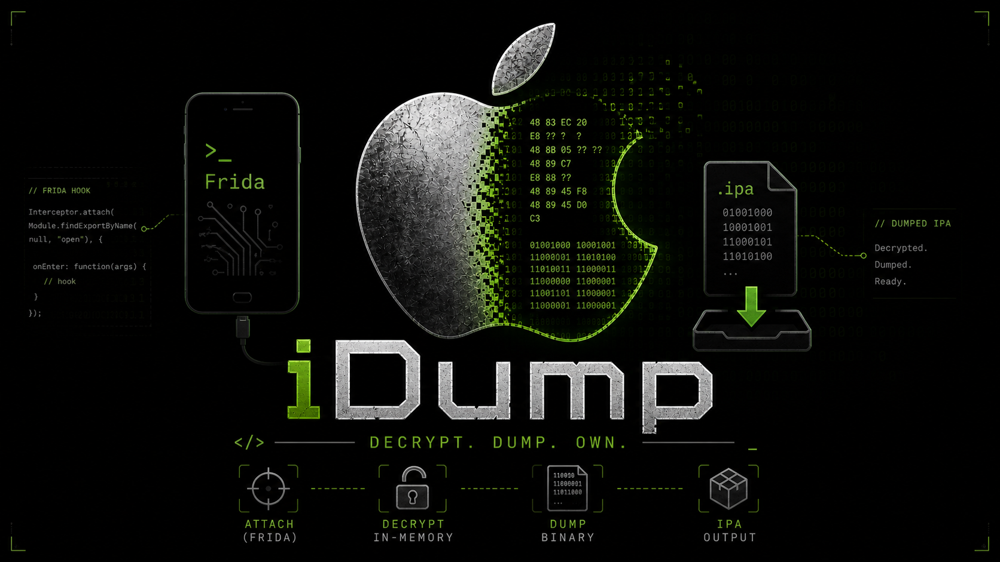

<p align="center">
  
</p>

<p align="center">
  <strong>Decrypt and dump iOS app binaries to an IPA file</strong>
</p>

---

## Background

`idump` started as a rethink of [frida-ios-dump](https://github.com/AloneMonkey/frida-ios-dump) — the well-known Python tool that has been a go-to for iOS binary decryption for years. Unfortunately, `frida-ios-dump` no longer works with Frida 17+ and appears unmaintained. Rather than patch a Python script, the Frida agent was migrated and updated to work with modern Frida, then wrapped in a new host tool that eliminates the old setup friction: Python, pip dependencies, and a pre-configured SSH connection just to dump a single app.

The main goal of `idump` is **autonomy**: a single, self-contained binary that embeds the Frida agent script and works out of the box. No Python, no pip, no manually downloaded scripts. Just copy the binary to your PATH and run it.

Built in Go with [frida-go](https://github.com/frida/frida-go), `idump` takes advantage of modern tooling while staying close to the same core technique — inject a Frida agent, patch `cryptid` in `LC_ENCRYPTION_INFO`, pull the decrypted Mach-O segments, and reassemble a valid IPA.

---

## Installation

### Pre-built binaries

Download the latest release for your platform from the [Releases](https://github.com/Fi5t/idump/releases) page, then copy the binary to your PATH:

```bash
# macOS (Apple Silicon)
curl -L https://github.com/Fi5t/idump/releases/latest/download/idump-darwin-arm64 -o idump
chmod +x idump
cp idump /usr/local/bin/
```

### Build from source

**Prerequisites:** Go 1.21+, Frida CLI (`pip install frida-tools`), `curl`, `tar`

```bash
git clone https://github.com/Fi5t/idump.git
cd idump
make devkit   # downloads frida-core-devkit matching your installed frida version
make build    # produces ./idump
cp idump /usr/local/bin/
```

---

## Usage

`idump` connects to a USB-attached iOS device via Frida. The device must have `frida-server` running (or use a Frida gadget).

### List installed apps

```bash
idump -l
```

### Dump an app (USB mode)

File contents are transferred through Frida messages directly — no SSH required.

```bash
idump com.example.App               # by bundle ID
idump "My App"                      # by display name
idump -o output.ipa com.example.App # custom output filename
```

### Dump an app (SSH/SFTP mode)

The Frida agent writes `.fid` files to the device; `idump` then retrieves them over SFTP and assembles the IPA. Useful when USB transfer is slow or unreliable for large apps.

```bash
idump remote com.example.App                        # defaults: root@localhost:2222, password alpine
idump remote -H 192.168.1.10 -p 22 com.example.App # custom host/port
idump remote -K ~/.ssh/id_rsa com.example.App       # SSH key authentication
idump remote -u mobile -P password com.example.App  # custom credentials
```

### Flags

**USB mode (`idump`):**

| Flag | Short | Default | Description |
|------|-------|---------|-------------|
| `--list` | `-l` | — | List installed apps |
| `--output` | `-o` | app display name | Output IPA filename |

**SSH/SFTP mode (`idump remote`):**

| Flag | Short | Default | Description |
|------|-------|---------|-------------|
| `--output` | `-o` | app display name | Output IPA filename |
| `--host` | `-H` | `localhost` | SSH hostname |
| `--port` | `-p` | `2222` | SSH port |
| `--user` | `-u` | `root` | SSH username |
| `--password` | `-P` | `alpine` | SSH password |
| `--key` | `-K` | — | SSH private key file |

---

## Development

### Prerequisites

- Go 1.21+
- Frida CLI (`pip install frida-tools`) — the devkit version is pinned to match it
- `curl`, `tar` (for downloading the devkit)

### 1. Get frida-go

`frida-go` uses CGO to wrap Frida's C library. Add it to the module:

```bash
go get github.com/frida/frida-go/frida@latest
```

### 2. Download the Frida Core devkit

The build requires `libfrida-core.a` and `frida-core.h`. The script auto-detects the Frida version from the system `frida` binary:

```bash
make devkit
```

To pin a specific version instead:

```bash
make devkit FRIDA_VERSION=17.x.y
```

This downloads and extracts the devkit to `build/frida-devkit/`.

### 3. Build

```bash
make build   # produces ./idump
```

### 4. Test

```bash
make test    # go test ./...
```

### Updating the Frida agent (`dump.ts`)

The TypeScript agent in `agent/dump.ts` is pre-compiled to `internal/dump.js` and embedded directly into the binary. When you edit `dump.ts`, recompile and commit the result:

```bash
make generate-ts            # requires devkit (step 2)
git add internal/dump.js
git commit
```
